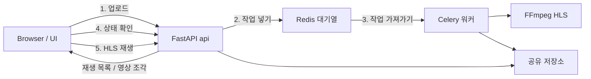

# FastAPI + Celery 영상 인코딩

PyCon 2026 핸즈온 튜토리얼

---

<header>프로젝트 목표</header>

- 오래 걸리는 일을 HTTP 요청 밖으로 빼는 이유 이해하기
- FastAPI는 업로드·상태 조회, Celery는 인코딩으로 역할 나누기
- HLS로 만든 결과를 상태 확인 후 브라우저에서 재생하기
- 실습 밖 운영 이슈는 개념만 훑어보기

---

<header>문제: 요청 안에서 인코딩하면?</header>

영상 인코딩은 수 초~수 분이 걸리는, CPU를 많이 쓰는 작업.

API 요청을 처리하는 코드에서 FFmpeg를 바로 돌리면:

- 응답이 올 때까지 브라우저가 계속 기다림
- 시간이 너무 길면 끊기거나 실패하기 쉬움
- 웹 서버가 인코딩에 묶여 다른 요청을 못 받음

오늘 목표: **업로드는 바로 받고(`202` + `job_id`), 인코딩은 워커가 처리**

---

<header>HLS</header>

영상을 짧은 조각으로 나눠 HTTP로 보내는 재생 방식.
처음부터 전체를 받지 않아도 재생을 시작할 수 있음.

- 브라우저는 재생 목록(`.m3u8`)을 보고 필요한 조각만 순서대로 받아 재생
- 그래서 재생이 더 빨리 시작됨 (예시: 유튜브, 넷플릭스, OTT)


---

<header>백그라운드 작업</header>

오래 걸리는 일을 사용자가 끝까지 기다리지 않고,<br/>
작업만 대기열에 넣은 뒤 서버(또는 워커)가 뒤에서 처리하는 방식.


---

<header>FastAPI async ≠ Celery</header>

둘 다 비동기로 불리지만, 하는 일이 다름.

| 구분 | FastAPI `async`/`await` | Celery 작업 대기열 |
| --- | --- | --- |
| 목적 | 기다리기 많은 요청을 한 프로세스에서 많이 처리 | 오래 걸리는 일을 HTTP 밖으로 빼기 |
| 실행 위치 | 웹 서버 안 | 별도 워커 프로세스 |
| 잘 맞는 일 | DB·네트워크·파일 읽기처럼 기다리는 일 | FFmpeg처럼 오래 걸리는 변환 |
| 응답 | 요청 안에서 처리가 끝나야 응답 | `job_id`를 바로 주고고, 결과는 나중에 조회 |

이번 튜토리얼의 핵심은 **Celery로 인코딩을 빼는 것**.

---

<header>결과물 데이터 흐름</header>

업로드는 API가 받고, 인코딩은 Celery 워커가 Redis 대기열을 통해 뒤에서 처리.



- FastAPI: 업로드 받기, 작업 넣기, 상태 API, 페이지·HLS 파일 제공
- Redis: 작업 대기열 + 작업 상태 저장
- Celery 워커: 대기열에서 일을 꺼내 FFmpeg 실행
- FFmpeg: 원본 → HLS(`playlist.m3u8` + 영상 조각 파일)
- 공유 저장소: FastAPI와 워커가 같이 보는 원본·결과 폴더

---

<header>FastAPI</header>

### 3가지 핵심
1. Python으로 HTTP API를 빠르게 만드는 웹 프레임워크 (ASGI 기반)
2. `async`/`await`로 동시 요청을 효율적으로 처리
3. 타입 힌트로 요청·응답 검사와 API 문서(`/docs`)를 자동 생성

---

<header>FastAPI 문법</header>

이번 튜토리얼에서 쓰는 문법

- `app = FastAPI(...)`: 앱 만들기
- `APIRouter`: 경로(URL) 묶음
- `include_router(..., prefix="/api")`: `/api` 아래에 경로 붙이기
- `UploadFile` / `File(...)`: 영상 파일 업로드 받기
- `StaticFiles`: HTML/CSS/JS·미디어 파일 제공

---

<header>요청 처리 흐름</header>

브라우저 요청이 웹 서버 → 프레임워크 → 앱으로 전달됨


- Uvicorn: 문을 열고 HTTP를 받아 앱에 넘기는 서버
- FastAPI: 어떤 URL로 갈지, 입력이 맞는지, 응답을 어떻게 보낼지 담당

---

<header>ASGI와 WSGI</header>

웹 서버와 Python 앱을 연결하는 방법으로, 비동기/동기 처리로 구분됨
| 구분 | WSGI | ASGI |
| --- | --- | --- |
| 의미 | Web Server Gateway Interface | Asynchronous Server Gateway Interface |
| 요청 처리 | 동기 중심 | 동기·비동기 모두 가능 |
| 대표 서버 | Gunicorn, uWSGI | Uvicorn, Hypercorn |
| 대표 프레임워크 | Django(전통), Flask | FastAPI, Starlette, Django(ASGI 모드) |

- 예전 Django: WSGI + 프로세스/스레드로 요청 처리
- FastAPI: ASGI 위에서 기다리기 많은 일을 효율적으로 다루고, 동기 코드는 필요 시 별도 스레드로 넘김

---

<header>스레드와 이벤트 루프</header>

FastAPI는 이벤트 루프를 기본으로 쓰고, 동기 코드는 필요할 때 스레드로 넘김.

| 구분 | 스레드 | 이벤트 루프 |
| --- | --- | --- |
| 누가 관리 | 운영체제 | 애플리케이션 |
| 동시 처리 | 여러 스레드가 같이 돎 | 한 스레드에서 일을 번갈아 처리 |
| 장점 | CPU를 쓰는 일에 상대적으로 맞음 | 기다리기 많은 일에 효율적 |
| 단점 | 메모리·전환 비용이 큼 | CPU를 오래 쓰는 일에는 약함 |
| FastAPI | 필요할 때 스레드 풀 사용 | 기본 방식 |

※ FFmpeg처럼 오래 걸리는 CPU 작업은 이벤트 루프에 두면 안 됨 → **별도 Celery 워커**

---

<header>Celery</header>

Redis 같은 외부 대기열로 일을 워커에 나눠 주는 백그라운드 작업 도구. <br/>
API는 일을 적재하고 실제 실행은 Celery 워커가 담당.

- **Broker (작업 대기열)**: 대기 중인 일을 보관. 앱과 워커 사이에서 중계
- **Worker (워커)**: 대기열에서 일을 꺼내 FFmpeg 등 실행
- **Result backend (상태 저장)**: `PENDING` / `STARTED` / `SUCCESS` / `FAILURE` 보관
- **Task (작업 함수)**: `@app.task`로 등록한 함수. 워커에서 이 로직이 실행됨

※ API와 워커는 **같은 저장 공간**을 봐야 원본과 HLS 결과를 주고받을 수 있음.

---

<header>실습</header>

저장소: [https://github.com/DSeung001/pycon-2026-fastapi-celery-tutorial.git](https://github.com/DSeung001/pycon-2026-fastapi-celery-tutorial.git)

개발 환경은 미리 세팅된 상태로 진행.<br/>
막히면 해당 체크포인트 브랜치로 옮겨 이어서 실습.

```cli
git fetch origin
python scripts/dev.py docker
```

체크포인트는 `00` → `04` 순으로 기능을 쌓음.

---

<header>Checkpoint 00</header>

### FastAPI 초기 세팅

- Docker로 FastAPI 앱 켜기
- `/api/health`와 `/docs` 확인

```cli
git switch checkpoint/00-fastapi-setup
```

성공 기준: `GET /api/health`가 `{"status":"ok"}`를 돌려줌

---

<header>Checkpoint 01</header>

### FastAPI 업로드

아직 인코딩은 없음. 업로드와 `job_id` 저장만 만듦.

- 영상 업로드 API 만들기
- `job_id` 폴더에 원본 저장

```cli
git switch checkpoint/01-fastapi-upload
```

성공 기준: `POST /api/videos` 응답에 `job_id`, `source_url`이 있음

---

<header>Checkpoint 02</header>

### Celery + Redis

- 업로드 직후 작업을 대기열에 넣기
- `GET /api/jobs/{job_id}`로 상태 확인
- API는 인코딩이 끝날 때까지 기다리지 않음

```cli
git switch checkpoint/02-celery-redis
```

성공 기준: API는 바로 `202`를 주고, 워커 로그에 작업 수신이 보임

---

<header>Checkpoint 03</header>

### FFmpeg HLS

- **워커에서만** FFmpeg 실행
- `playlist.m3u8`와 조각 파일 생성
- 재생 목록이 있을 때만 `SUCCESS`

```cli
git switch checkpoint/03-ffmpeg-hls
```

성공 기준: `SUCCESS`일 때 `hls_url`이 내려옴

---

<header>Checkpoint 04</header>

### HLS Player

- 작업 상태를 주기적으로 확인
- 원본과 HLS 결과를 나란히 재생

```cli
git switch checkpoint/04-hls-player
```

성공 기준: `SUCCESS` / `FAILURE`에서 상태 확인이 멈추고 영상이 재생됨

---

<header>운영에서 더 생각해 볼 것</header>

초급 실습에서는 안 만들지만, 실제 서비스에서는 이런 이슈가 이어질 수 있습니다.

- 인코딩이 너무 길 때 끊기(시간 제한)
- 실패 후 다시 시도할 때, 같은 일이 두 번 돌아가도 결과가 같게 만들기
- 워커가 동시에 몇 개까지 인코딩할지
- 업로드 용량 제한과 결과 파일 정리
- 작업 상태를 DB에 남기기, 파일을 외부 저장소(S3 등)에 두기
- 로그·숫자 지표 저장 및 볼 수 있는 방법 구상
- 에러 발생 시 알림 시스템

차례대로 하나씩 생각해 보면 좋을 것 같습니다.

---

# Q&A
