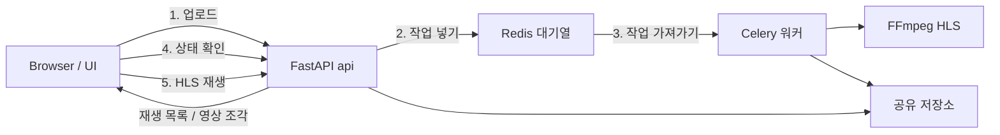

# FastAPI + Celery 영상 인코딩

PyCon 2026 핸즈온 튜토리얼

---

<header>프로젝트 목표</header>

- 오래 걸리는 일을 HTTP 요청 밖으로 빼는 이유 이해하기
- FastAPI는 업로드·상태 조회, Celery는 인코딩으로 역할 나누기
- HLS로 만든 결과를 상태 확인 후 브라우저에서 재생하기
- 실습 밖 운영 이슈는 개념만 훑어보기

---

<header>문제: 요청 안에서 인코딩하면?</header>

영상 인코딩은 수 초~수 분이 걸리는, CPU를 많이 쓰는 작업.

API 요청을 처리하는 코드에서 FFmpeg를 바로 돌리면:

- 응답이 올 때까지 브라우저가 계속 기다림
- 시간이 너무 길면 끊기거나 실패하기 쉬움
- 웹 서버가 인코딩에 묶여 다른 요청을 못 받음

오늘 목표: **업로드는 바로 받고(`202` + `job_id`), 인코딩은 워커가 처리**

---

<header>HLS</header>

영상을 짧은 조각으로 나눠 HTTP로 보내는 재생 방식.
처음부터 전체를 받지 않아도 재생을 시작할 수 있음.

- 브라우저는 재생 목록(`.m3u8`)을 보고 필요한 조각만 순서대로 받아 재생
- 그래서 재생이 더 빨리 시작됨 (예시: 유튜브, 넷플릭스, OTT)


---

<header>백그라운드 작업</header>

오래 걸리는 일을 사용자가 끝까지 기다리지 않고,<br/>
작업만 대기열에 넣은 뒤 서버(또는 워커)가 뒤에서 처리하는 방식.


---

<header>FastAPI async ≠ Celery</header>

둘 다 비동기로 불리지만, 하는 일이 다름.

| 구분 | FastAPI `async`/`await` | Celery 작업 대기열 |
| --- | --- | --- |
| 목적 | 기다리기 많은 요청을 한 프로세스에서 많이 처리 | 오래 걸리는 일을 HTTP 밖으로 빼기 |
| 실행 위치 | 웹 서버 안 | 별도 워커 프로세스 |
| 잘 맞는 일 | DB·네트워크·파일 읽기처럼 기다리는 일 | FFmpeg처럼 오래 걸리는 변환 |
| 응답 | 요청 안에서 처리가 끝나야 응답 | `job_id`를 바로 주고고, 결과는 나중에 조회 |

이번 튜토리얼의 핵심은 **Celery로 인코딩을 빼는 것**.

---

<header>결과물 데이터 흐름</header>

업로드는 API가 받고, 인코딩은 Celery 워커가 Redis 대기열을 통해 뒤에서 처리.



- FastAPI: 업로드 받기, 작업 넣기, 상태 API, 페이지·HLS 파일 제공
- Redis: 작업 대기열 + 작업 상태 저장
- Celery 워커: 대기열에서 일을 꺼내 FFmpeg 실행
- FFmpeg: 원본 → HLS(`playlist.m3u8` + 영상 조각 파일)
- 공유 저장소: FastAPI와 워커가 같이 보는 원본·결과 폴더

---

<header>FastAPI</header>

### 3가지 핵심
1. Python으로 HTTP API를 빠르게 만드는 웹 프레임워크 (ASGI 기반)
2. `async`/`await`로 동시 요청을 효율적으로 처리
3. 타입 힌트로 요청·응답 검사와 API 문서(`/docs`)를 자동 생성

---

<header>FastAPI 문법</header>

이번 튜토리얼에서 쓰는 문법

- `app = FastAPI(...)`: 앱 만들기
- `APIRouter`: 경로(URL) 묶음
- `include_router(..., prefix="/api")`: `/api` 아래에 경로 붙이기
- `UploadFile` / `File(...)`: 영상 파일 업로드 받기
- `StaticFiles`: HTML/CSS/JS·미디어 파일 제공

---

<header>요청 처리 흐름</header>

브라우저 요청이 웹 서버 → 프레임워크 → 앱으로 전달됨


- Uvicorn: 문을 열고 HTTP를 받아 앱에 넘기는 서버
- FastAPI: 어떤 URL로 갈지, 입력이 맞는지, 응답을 어떻게 보낼지 담당

---

<header>ASGI와 WSGI</header>

웹 서버와 Python 앱을 연결하는 방법으로, 비동기/동기 처리로 구분됨
| 구분 | WSGI | ASGI |
| --- | --- | --- |
| 의미 | Web Server Gateway Interface | Asynchronous Server Gateway Interface |
| 요청 처리 | 동기 중심 | 동기·비동기 모두 가능 |
| 대표 서버 | Gunicorn, uWSGI | Uvicorn, Hypercorn |
| 대표 프레임워크 | Django(전통), Flask | FastAPI, Starlette, Django(ASGI 모드) |

- 예전 Django: WSGI + 프로세스/스레드로 요청 처리
- FastAPI: ASGI 위에서 기다리기 많은 일을 효율적으로 다루고, 동기 코드는 필요 시 별도 스레드로 넘김

---

<header>스레드와 이벤트 루프</header>

FastAPI는 이벤트 루프를 기본으로 쓰고, 동기 코드는 필요할 때 스레드로 넘김.

| 구분 | 스레드 | 이벤트 루프 |
| --- | --- | --- |
| 누가 관리 | 운영체제 | 애플리케이션 |
| 동시 처리 | 여러 스레드가 같이 돎 | 한 스레드에서 일을 번갈아 처리 |
| 장점 | CPU를 쓰는 일에 상대적으로 맞음 | 기다리기 많은 일에 효율적 |
| 단점 | 메모리·전환 비용이 큼 | CPU를 오래 쓰는 일에는 약함 |
| FastAPI | 필요할 때 스레드 풀 사용 | 기본 방식 |

※ FFmpeg처럼 오래 걸리는 CPU 작업은 이벤트 루프에 두면 안 됨 → **별도 Celery 워커**

---

<header>Celery</header>

Redis 같은 외부 대기열로 일을 워커에 나눠 주는 백그라운드 작업 도구. <br/>
API는 일을 적재하고 실제 실행은 Celery 워커가 담당.

- **Broker (작업 대기열)**: 대기 중인 일을 보관. 앱과 워커 사이에서 중계
- **Worker (워커)**: 대기열에서 일을 꺼내 FFmpeg 등 실행
- **Result backend (상태 저장)**: `PENDING` / `STARTED` / `SUCCESS` / `FAILURE` 보관
- **Task (작업 함수)**: `@app.task`로 등록한 함수. 워커에서 이 로직이 실행됨

※ API와 워커는 **같은 저장 공간**을 봐야 원본과 HLS 결과를 주고받을 수 있음.

---

<header>실습</header>

개발 환경은 미리 세팅된 상태로 진행.<br/>
막히면 해당 체크포인트 브랜치로 옮겨 이어서 실습.

```cli
git fetch origin
python scripts/dev.py docker
```

체크포인트는 `00` → `04` 순으로 기능을 쌓음.

---

<header>Checkpoint 00</header>

### FastAPI 초기 세팅

- Docker로 FastAPI 앱 켜기
- `/api/health`와 `/docs` 확인

```cli
git switch checkpoint/00-fastapi-setup
```

성공 기준: `GET /api/health`가 `{"status":"ok"}`를 돌려줌

---

<header>Checkpoint 01</header>

### FastAPI 업로드

아직 인코딩은 없음. 업로드와 `job_id` 저장만 만듦.

- 영상 업로드 API 만들기
- `job_id` 폴더에 원본 저장

```cli
git switch checkpoint/01-fastapi-upload
```

성공 기준: `POST /api/videos` 응답에 `job_id`, `source_url`이 있음

---

<header>Checkpoint 01 · api/app/config.py</header>

경로·업로드 한도·허용 확장자·미디어 URL 설정.

```python {scale=sm, path=api/app/config.py}
import os
from pathlib import Path

# 경로 설정
DATA_ROOT = Path(os.getenv("DATA_ROOT", "/data"))
INPUTS_DIR = DATA_ROOT / "inputs"
OUTPUTS_DIR = DATA_ROOT / "outputs"
SOURCE_BASENAME = "source"

# 업로드 용량 설정
MB = 1024 * 1024
CHUNK_SIZE = 4 * MB
DEFAULT_MAX_UPLOAD_BYTES = 100 * MB
MAX_UPLOAD_BYTES = int(
    os.getenv("MAX_UPLOAD_BYTES", str(DEFAULT_MAX_UPLOAD_BYTES))
)

# 확장자 설정
ALLOWED_EXTENSIONS = {
    extension.strip().lower()
    for extension in os.getenv("ALLOWED_EXTENSIONS", "mp4,mov,webm").split(",")
    if extension.strip()
}

# 미디어(클라이언트에서 접근 가능) 경로 설정
MEDIA_INPUTS_URL = "/media/inputs"
MEDIA_OUTPUTS_URL = "/media/outputs"
```

---

<header>Checkpoint 01 · api/app/main.py</header>

inputs/outputs 폴더 생성 후 `/media/*`로 파일 제공.

```python {scale=sm, path=api/app/main.py}
from fastapi import FastAPI
from fastapi.staticfiles import StaticFiles

from app.config import (
    INPUTS_DIR,
    MEDIA_INPUTS_URL,
    MEDIA_OUTPUTS_URL,
    OUTPUTS_DIR,
)
from app.routes import router as api_router

# FastAPI 앱 인스턴스 생성
app = FastAPI(title="Pycon 2026 Video Converter")

# 라우터 등록
app.include_router(api_router, prefix="/api")

# 입력 및 출력 폴더 생성
INPUTS_DIR.mkdir(parents=True, exist_ok=True)
OUTPUTS_DIR.mkdir(parents=True, exist_ok=True)

# 입력 및 출력 파일 제공
app.mount(MEDIA_INPUTS_URL, StaticFiles(directory=INPUTS_DIR), name="inputs")
app.mount(MEDIA_OUTPUTS_URL, StaticFiles(directory=OUTPUTS_DIR), name="outputs")

# 튜토리얼 페이지 제공
app.mount("/", StaticFiles(directory="static", html=True), name="static")
```

---

<header>Checkpoint 01 · api/app/routes.py</header>

`/health` 대신 `POST /api/videos`로 업로드·`job_id` 저장.

```python {scale=xs, path=api/app/routes.py}
import uuid
from pathlib import Path

from fastapi import APIRouter, File, HTTPException, UploadFile

from app.config import (
    ALLOWED_EXTENSIONS,
    CHUNK_SIZE,
    INPUTS_DIR,
    MAX_UPLOAD_BYTES,
    MEDIA_INPUTS_URL,
    SOURCE_BASENAME,
)

router = APIRouter()


@router.post("/videos", status_code=201)
async def upload_video(file: UploadFile = File(...)):
    if not file.filename:
        raise HTTPException(400, "Missing file")

    ext = Path(file.filename).suffix.lstrip(".").lower()
    if ext not in ALLOWED_EXTENSIONS:
        raise HTTPException(400, f"Unsupported extension: {ext}")

    job_id = str(uuid.uuid4())
    job_dir = INPUTS_DIR / job_id
    job_dir.mkdir(parents=True, exist_ok=True)
    dest = job_dir / f"{SOURCE_BASENAME}.{ext}"

    total = 0
    try:
        with dest.open("wb") as out:
            while chunk := await file.read(CHUNK_SIZE):
                total += len(chunk)
                if total > MAX_UPLOAD_BYTES:
                    raise HTTPException(413, "Upload too large")
                out.write(chunk)
    except Exception:
        if dest.exists():
            dest.unlink()
        job_dir.rmdir()
        raise

    if total == 0:
        dest.unlink()
        job_dir.rmdir()
        raise HTTPException(400, "Empty file")

    source_url = f"{MEDIA_INPUTS_URL}/{job_id}/{SOURCE_BASENAME}.{ext}"
    return {
        "job_id": job_id,
        "source_url": source_url,
    }
```

---

<header>Checkpoint 01 · docker-compose.yml</header>

`DATA_ROOT` env와 `./data` 볼륨 연결.

```yaml {scale=sm, path=docker-compose.yml}
# 서비스 목록
services:

  # FastAPI 서비스
  api:
    build: ./api # ./api/Dockerfile 빌드
    ports:
      - "8000:8000"

    # 환경변수
    environment:
      DATA_ROOT: /data
      MAX_UPLOAD_BYTES: "104857600" # 100MB
      ALLOWED_EXTENSIONS: "mp4,mov,webm"

    # 볼륨 마운트
    # 도커 컨테이너 안의 폴더와 내 PC의 폴더를 연결해 줘서 이 폴더를 영구적으로 보존할 수 있게 해줌
    volumes:
      - ./data:/data
      - ./static:/app/static:ro

    # 실행 시 동작할 명령어
    command: uvicorn app.main:app --host 0.0.0.0 --port 8000 --reload
```

---

<header>Checkpoint 01 · scripts/dev.py</header>

로컬 실행용 `DATA_ROOT` 환경변수·`data/` 폴더 준비. (추가분)

```python {scale=sm, path=scripts/dev.py}
DATA_ROOT = PROJECT_ROOT / "data"


def local_env() -> dict[str, str]:
    return {
        **os.environ,
        "DATA_ROOT": str(DATA_ROOT),
    }


# install() 안에서:
DATA_ROOT.mkdir(parents=True, exist_ok=True)

# api() 실행 시:
env=local_env()
```

---

<header>Checkpoint 01 · 프론트</header>

`static/` HTML·CSS는 브랜치에 포함된 업로드 UI를 그대로 사용.
핵심 실습은 Python API.

---

<header>Checkpoint 02</header>

### Celery + Redis

- 업로드 직후 작업을 대기열에 넣기
- `GET /api/jobs/{job_id}`로 상태 확인
- API는 인코딩이 끝날 때까지 기다리지 않음

```cli
git switch checkpoint/02-celery-redis
```

성공 기준: API는 바로 `202`를 주고, 워커 로그에 작업 수신이 보임

---

<header>Checkpoint 02 · api/app/config.py</header>

`REDIS_URL`·`ENCODE_TASK` 추가.

```python {scale=sm, path=api/app/config.py}
# Celery 설정
REDIS_URL = os.getenv("REDIS_URL", "redis://localhost:6379/0")
ENCODE_TASK = "encode_video"
```

---

<header>Checkpoint 02 · api/app/celery_client.py</header>

API에서 Celery로 작업 넣기·상태 조회용 클라이언트.

```python {scale=sm, path=api/app/celery_client.py}
import os
from celery import Celery
from app.config import REDIS_URL

# broker: Redis를 사용하여 작업을 전달하는 브로커
# backend: Redis를 사용하여 작업 결과를 저장하 곳 (잡 진행 상태 기록)
celery = Celery(
    "api",
    broker=REDIS_URL,
    backend=REDIS_URL,
)

# Celery의 작업은 backend에서 다음으로 상태가 표시됨
# 기본 값: PENDING / STARTED / RETRY / SUCCESS / FAILURE
celery.conf.update(
    task_track_started=True, # STARTED 상태로 시작
    task_serializer="json", # 작업 데이터를 JSON 직렬화 
    result_serializer="json", # 결과 데이터를 JSON 직렬화
    accept_content=["json"], # 허용 포멧
    timezone="Asia/Seoul", # 시간대
    enable_utc=False, # UTC 사용 여부
)
```

---

<header>Checkpoint 02 · api/app/routes.py (1/2)</header>

`202` 반환, `send_task`로 enqueue, `GET /jobs/{job_id}` 추가.

```python {scale=xs, path=api/app/routes.py}
import uuid
from pathlib import Path

from fastapi import APIRouter, File, HTTPException, UploadFile

from app.config import (
    ALLOWED_EXTENSIONS,
    CHUNK_SIZE,
    INPUTS_DIR,
    MAX_UPLOAD_BYTES,
    MEDIA_INPUTS_URL,
    SOURCE_BASENAME,
    ENCODE_TASK,
)

from app.celery_client import celery

router = APIRouter()


@router.post("/videos", status_code=202)
async def upload_video(file: UploadFile = File(...)):
    if not file.filename:
        raise HTTPException(400, "Missing file")

    ext = Path(file.filename).suffix.lstrip(".").lower()
    if ext not in ALLOWED_EXTENSIONS:
        raise HTTPException(400, f"Unsupported extension: {ext}")

    job_id = str(uuid.uuid4())
    job_dir = INPUTS_DIR / job_id
    job_dir.mkdir(parents=True, exist_ok=True)
    dest = job_dir / f"{SOURCE_BASENAME}.{ext}"

    total = 0
    try:
        with dest.open("wb") as out:
            while chunk := await file.read(CHUNK_SIZE):
                total += len(chunk)
                if total > MAX_UPLOAD_BYTES:
                    raise HTTPException(413, "Upload too large")
                out.write(chunk)
    except Exception:
        if dest.exists():
            dest.unlink()
        job_dir.rmdir()
        raise

    if total == 0:
        dest.unlink()
        job_dir.rmdir()
        raise HTTPException(400, "Empty file")

    try:
        celery.send_task(
```

---

<header>Checkpoint 02 · api/app/routes.py (2/2)</header>

api/app/routes.py 이어서

```python {scale=xs, path=api/app/routes.py}
            ENCODE_TASK,
            args=[job_id, ext],
            task_id=job_id,
        )
    except Exception:
        dest.unlink(missing_ok=True)
        job_dir.rmdir()
        raise HTTPException(500, "Failed to enqueue job")

    source_url = f"{MEDIA_INPUTS_URL}/{job_id}/{SOURCE_BASENAME}.{ext}"
    return {
        "job_id": job_id,
        "status": "PENDING",
        "status_url": f"/api/jobs/{job_id}",
        "source_url": source_url,
    }


@router.get("/jobs/{job_id}")
def get_job(job_id: str):
    job_dir = INPUTS_DIR / job_id
    if not job_dir.exists():
        raise HTTPException(404, "Job not found")

    sources: list[Path] = list(job_dir.glob(f"{SOURCE_BASENAME}.*"))
    if not sources:
        raise HTTPException(404, "Unknown job")
    ext = sources[0].suffix.lstrip(".")
    source_url = f"{MEDIA_INPUTS_URL}/{job_id}/{SOURCE_BASENAME}.{ext}"

    result = celery.AsyncResult(job_id)
    status = result.state

    response = {
        "job_id": job_id,
        "status": status,
        "source_url": source_url,
    }

    if status == "FAILURE":
        response["error"] = "Background task failed"
    return response
```

---

<header>Checkpoint 02 · worker 뼈대</header>

`config` / `requirements` / `Dockerfile` / stub `tasks` / `celery_app`.

```python {scale=xs, path=worker/app/config.py}
import os
from pathlib import Path

# Redis
REDIS_URL = os.getenv("REDIS_URL", "redis://localhost:6379/0")

# Celery 설정
ENCODE_TASK = "encode_video"
```

```text {scale=xs, path=worker/requirements.txt}
celery[redis]>=5.3
```

```dockerfile {scale=xs, path=worker/Dockerfile}
FROM python:3.12-slim
WORKDIR /app
COPY requirements.txt .
RUN pip install --no-cache-dir -r requirements.txt
COPY app ./app
```

```python {scale=xs, path=worker/app/tasks.py}
import logging
import time

from app.celery_app import celery
from app.config import ENCODE_TASK

logger = logging.getLogger(__name__)


@celery.task(name=ENCODE_TASK)
def encode_video(job_id: str, ext: str):
    """Checkpoint 02용 stub 작업. 실제 FFmpeg는 Checkpoint 03에서 연결한다."""
    logger.info("stub encode started job_id=%s ext=%s", job_id, ext)
    time.sleep(2)
    logger.info("stub encode finished job_id=%s", job_id)
    return {"job_id": job_id, "stub": True}
```

```python {scale=xs, path=worker/app/celery_app.py}
from celery import Celery
from app.config import REDIS_URL

celery = Celery(
    "worker", 
    broker=REDIS_URL, 
    backend=REDIS_URL,
)

# Celery의 작업은 backend에서 다음으로 상태가 표시됨
# 기본 값: PENDING / STARTED / RETRY / SUCCESS / FAILURE
celery.conf.update(
    task_track_started=True, # STARTED 상태로 시작
    task_serializer="json", # 작업 데이터를 JSON 직렬화 
    result_serializer="json", # 결과 데이터를 JSON 직렬화
    accept_content=["json"], # 허용 포멧
    timezone="Asia/Seoul", # 시간대
    enable_utc=False, # UTC 사용 여부
)

# import 에러 방지
import app.tasks  # noqa: F401
```

---

<header>Checkpoint 02 · api/requirements.txt</header>

`celery[redis]` 의존성 추가.

```text {scale=sm, path=api/requirements.txt}
fastapi>=0.110
uvicorn[standard]>=0.27
python-multipart>=0.0.9
celery[redis]>=5.3
```

---

<header>Checkpoint 02 · docker-compose.yml</header>

Redis + API + worker. 공유 `./data` 볼륨.

```yaml {scale=xs, path=docker-compose.yml}
# 서비스 목록
services:

  # Redis 서비스
  redis:
    image: redis:7-alpine
    # 포트 포워딩
    ports:
      - "6379:6379"
    # 헬스 체크
    healthcheck:
      test: ["CMD", "redis-cli", "ping"]
      interval: 5s
      timeout: 3s
      retries: 5


  # FastAPI 서비스
  api:
    build: ./api # ./api/Dockerfile 빌드
    depends_on:
      redis:
        condition: service_healthy
    ports:
      - "8000:8000"

    # 환경변수
    environment:
      DATA_ROOT: /data
      MAX_UPLOAD_BYTES: "104857600" # 100MB
      ALLOWED_EXTENSIONS: "mp4,mov,webm"
      REDIS_URL: redis://redis:6379/0

    # 볼륨 마운트
    # 도커 컨테이너 안의 폴더와 내 PC의 폴더를 연결해 줘서 이 폴더를 영구적으로 보존할 수 있게 해줌
    volumes:
      - ./data:/data
      - ./static:/app/static:ro

    # 실행 시 동작할 명령어
    command: uvicorn app.main:app --host 0.0.0.0 --port 8000 --reload

  # Celery 워커, 별도 프로세스
  worker:
    build: ./worker
    environment:
      DATA_ROOT: /data
      REDIS_URL: redis://redis:6379/0
    volumes:
      - ./data:/data
    # 의존성 설정
    depends_on:
      redis:
        condition: service_healthy
    # 실행 파일 지정 및 로그 레벨 설정
    command: celery -A app.celery_app.celery worker --loglevel=info
```

---

<header>Checkpoint 02 · scripts/dev.py</header>

`redis` / `worker` 명령과 로컬 `REDIS_URL` 지원.

```python {scale=xs, path=scripts/dev.py}
import argparse
import os
import subprocess
import sys
from pathlib import Path

PROJECT_ROOT = Path(__file__).resolve().parent.parent
VENV_DIR = PROJECT_ROOT / ".venv"
API_REQUIREMENTS = PROJECT_ROOT / "api" / "requirements.txt"
WORKER_REQUIREMENTS = PROJECT_ROOT / "worker" / "requirements.txt"
DATA_ROOT = PROJECT_ROOT / "data"
WORKER_DIR = PROJECT_ROOT / "worker"
REDIS_URL = os.getenv("REDIS_URL", "redis://localhost:6379/0")


def run(command: list[str], *, env=None, cwd: Path | None = None) -> None:
    """subprocess로 명령어 실행"""
    print(f"\n> {' '.join(map(str, command))}")
    subprocess.run(
        [str(arg) for arg in command],
        cwd=str(cwd or PROJECT_ROOT),
        env=env,
        check=True,
    )


def get_venv_python() -> Path:
    if sys.platform == "win32":
        return VENV_DIR / "Scripts" / "python.exe"
    return VENV_DIR / "bin" / "python"


def local_env() -> dict[str, str]:
    return {
        **os.environ,
        "DATA_ROOT": str(DATA_ROOT),
        "REDIS_URL": REDIS_URL,
    }


def install() -> None:
    """api + worker 의존성을 하나의 .venv에 설치"""
    if not VENV_DIR.exists():
        print("가상환경을 생성합니다.")
        run([sys.executable, "-m", "venv", VENV_DIR])

    py = get_venv_python()
    run([py, "-m", "pip", "install", "-r", API_REQUIREMENTS])
    run([py, "-m", "pip", "install", "-r", WORKER_REQUIREMENTS])
    DATA_ROOT.mkdir(parents=True, exist_ok=True)


def redis() -> None:
    """로컬용 Redis만 Docker로 기동"""
    run(["docker", "compose", "up", "-d", "redis"])


def api() -> None:
    """FastAPI (로컬)"""
    install()
    run(
        [
            get_venv_python(),
            "-m",
            "uvicorn",
            "app.main:app",
            "--app-dir",
            "api",
            "--reload",
        ],
        env=local_env(),
    )


def worker() -> None:
    """Celery worker (로컬, cwd=worker/)"""
    install()
    run(
        [
            get_venv_python(),
            "-m",
            "celery",
            "-A",
            "app.celery_app.celery",
            "worker",
            "--loglevel=info",
        ],
        env=local_env(),
        cwd=WORKER_DIR,
    )


def docker() -> None:
    """전체 스택 (api + redis + worker)"""
    run(["docker", "compose", "up", "--build"])


def main() -> None:
    parser = argparse.ArgumentParser(description="FastAPI + Celery 튜토리얼 개발 도우미")
    parser.add_argument(
        "command",
        choices=["install", "redis", "api", "worker", "docker"],
        help="실행할 명령",
    )
    args = parser.parse_args()

    commands = {
        "install": install,
        "redis": redis,
        "api": api,
        "worker": worker,
        "docker": docker,
    }
    commands[args.command]()


if __name__ == "__main__":
    main()
```

---

<header>Checkpoint 02 · 프론트</header>

상태 폴링 UI(`static/`)는 브랜치 코드를 사용.
핵심은 API enqueue와 워커 stub.

---

<header>Checkpoint 03</header>

### FFmpeg HLS

- **워커에서만** FFmpeg 실행
- `playlist.m3u8`와 조각 파일 생성
- 재생 목록이 있을 때만 `SUCCESS`

```cli
git switch checkpoint/03-ffmpeg-hls
```

성공 기준: `SUCCESS`일 때 `hls_url`이 내려옴

---

<header>Checkpoint 03 · worker/app/config.py</header>

API와 같은 `DATA_ROOT` 경로 설정.

```python {scale=sm, path=worker/app/config.py}
import os
from pathlib import Path

# 경로 설정
DATA_ROOT = Path(os.getenv("DATA_ROOT", "/data"))
INPUTS_DIR = DATA_ROOT / "inputs"
OUTPUTS_DIR = DATA_ROOT / "outputs"
SOURCE_BASENAME = "source"

# Redis
REDIS_URL = os.getenv("REDIS_URL", "redis://localhost:6379/0")

# Celery 설정
ENCODE_TASK = "encode_video"
```

---

<header>Checkpoint 03 · worker/Dockerfile</header>

이미지에 FFmpeg 설치.

```dockerfile {scale=sm, path=worker/Dockerfile}
FROM python:3.12-slim
WORKDIR /app
RUN apt-get update \
    && apt-get install -y --no-install-recommends ffmpeg \
    && rm -rf /var/lib/apt/lists/*
COPY requirements.txt .
RUN pip install --no-cache-dir -r requirements.txt
COPY app ./app
```

---

<header>Checkpoint 03 · worker/app/tasks.py</header>

워커에서만 FFmpeg 실행. `playlist.m3u8` 없으면 실패.

```python {scale=xs, path=worker/app/tasks.py}
import logging
import subprocess

from app.celery_app import celery
from app.config import (
    INPUTS_DIR, 
    OUTPUTS_DIR, 
    SOURCE_BASENAME, 
    ENCODE_TASK,
)

logger = logging.getLogger(__name__)

@celery.task(name=ENCODE_TASK)
def encode_video(job_id: str, ext: str):
    source = INPUTS_DIR / job_id / f"{SOURCE_BASENAME}.{ext}"
    out_dir = OUTPUTS_DIR / job_id
    playlist = out_dir / "playlist.m3u8"

    if not source.is_file():
        raise FileNotFoundError(f"source missing: {source}")

    out_dir.mkdir(parents=True, exist_ok=True)

    cmd = [
        "ffmpeg", "-y", "-i", str(source),
        "-c:v", "libx264", "-c:a", "aac",
        "-start_number", "0",
        "-hls_time", "2",
        "-hls_list_size", "0",
        "-f", "hls",
        "-hls_segment_filename", str(out_dir / "segment_%03d.ts"),
        str(playlist),
    ]
    
    try:
        # ffmpeg 실행
        completed = subprocess.run(cmd, check=True, capture_output=True, text=True)
        if completed.stderr:
            logger.info("ffmpeg stderr:\n%s", completed.stderr[-2000:])
    except FileNotFoundError as e:
        # ffmpeg 미설치 시
        raise RuntimeError("ffmpeg not found") from e
    except subprocess.CalledProcessError as e:
        # ffmpeg 실행 실패 시
        logger.error("ffmpeg failed:\n%s", (e.stderr or "")[-2000:])
        raise RuntimeError("ffmpeg failed") from e

    # HLS 파일 없을 때     
    if not playlist.is_file():
        raise RuntimeError("playlist.m3u8 missing")

    return {"hls_path": str(playlist)}
```

---

<header>Checkpoint 03 · api/app/routes.py (1/2)</header>

`SUCCESS`일 때 `hls_url` 포함. (주석 포함 최종본)

```python {scale=xs, path=api/app/routes.py}
import uuid
from pathlib import Path

from fastapi import APIRouter, File, HTTPException, UploadFile

from app.config import (
    ALLOWED_EXTENSIONS,
    CHUNK_SIZE,
    INPUTS_DIR,
    MAX_UPLOAD_BYTES,
    MEDIA_INPUTS_URL,
    MEDIA_OUTPUTS_URL,
    SOURCE_BASENAME,
    ENCODE_TASK,
)

from app.celery_client import celery

router = APIRouter()

# 202로 요청 수행 중임을 명시
@router.post("/videos", status_code=202)
async def upload_video(file: UploadFile = File(...)):
    # 파일 체크
    if not file.filename:
        raise HTTPException(400, "Missing file")

    # 파일 확장자 체크
    ext = Path(file.filename).suffix.lstrip(".").lower()
    if ext not in ALLOWED_EXTENSIONS:
        raise HTTPException(400, f"Unsupported extension: {ext}")

    # 폴더 생성
    job_id = str(uuid.uuid4())
    job_dir = INPUTS_DIR / job_id
    job_dir.mkdir(parents=True, exist_ok=True)
    dest = job_dir / f"{SOURCE_BASENAME}.{ext}"

    # 파일 저장
    total = 0
    try:
        with dest.open("wb") as out:
            while chunk := await file.read(CHUNK_SIZE):
                total += len(chunk)
                if total > MAX_UPLOAD_BYTES:
                    raise HTTPException(413, "Upload too large")
                out.write(chunk)
    except Exception:
        # 부분 저장 정리
        if dest.exists():
            dest.unlink()
        job_dir.rmdir()
        raise

    if total == 0:
        dest.unlink()
        job_dir.rmdir()
        raise HTTPException(400, "Empty file")

    # Celery 작업 등록
```

---

<header>Checkpoint 03 · api/app/routes.py (2/2)</header>

api/app/routes.py 이어서

```python {scale=xs, path=api/app/routes.py}
    try: 
        celery.send_task(
            ENCODE_TASK,
            args=[job_id, ext],
            task_id=job_id, 
        )
    except Exception:
        # 작업 등록 실패 시 파일 삭제
        dest.unlink(missing_ok=True)
        job_dir.rmdir()
        raise HTTPException(500, "Failed to enqueue job")

    source_url = f"{MEDIA_INPUTS_URL}/{job_id}/{SOURCE_BASENAME}.{ext}"
    # celery 작업만 등록하고 반환
    return {
        "job_id": job_id,
        "status": "PENDING",        
        "status_url": f"/api/jobs/{job_id}", # 작업 상태 조회 경로
        "source_url": source_url, # 원본 미디어 경로
    }

# 작업 가져오기
@router.get("/jobs/{job_id}")
def get_job(job_id: str):
    job_dir = INPUTS_DIR / job_id
    if not job_dir.exists():
        raise HTTPException(404, "Job not found")   
    
    # 원본 파일 조회
    sources: list[Path] = list(job_dir.glob(f"{SOURCE_BASENAME}.*"))
    if not sources:
        raise HTTPException(404, "Unknown job")
    ext = sources[0].suffix.lstrip(".")
    source_url = f"{MEDIA_INPUTS_URL}/{job_id}/{SOURCE_BASENAME}.{ext}"

    # Celery 작업 상태 조회, Redis Backend에서 정보 조회
    result = celery.AsyncResult(job_id)
    status = result.state # PENDING / STARTED / SUCCESS / FAILURE

    response = {
        "job_id": job_id,
        "status": status,
        "source_url": source_url,
    }

    if status == "SUCCESS":
        response["hls_url"] = f"{MEDIA_OUTPUTS_URL}/{job_id}/playlist.m3u8"
    elif status == "FAILURE":
        response["error"] = "Video encoding failed"
    return response
```

---

<header>Checkpoint 03 · 프론트</header>

`hls_url` 힌트 UI는 브랜치 `static/`을 사용.
핵심은 워커 FFmpeg와 API `hls_url`.

---

<header>Checkpoint 04</header>

### HLS Player

프론트(HTML/CSS/JS)는 직접 작성하지 않고 GitHub에서 받음.

- 저장소: [pycon-2026-fastapi-celery-tutorial](https://github.com/DSeung001/pycon-2026-fastapi-celery-tutorial)
- `static/index.html`, `static/style.css`를 `checkpoint/04-hls-player` 기준으로 가져오기

```cli
git fetch origin
git switch checkpoint/04-hls-player
python scripts/dev.py docker
```

또는 GitHub에서 파일 열기:
https://github.com/DSeung001/pycon-2026-fastapi-celery-tutorial/tree/checkpoint/04-hls-player/static

성공 기준: `SUCCESS` / `FAILURE`에서 상태 확인이 멈추고 영상이 재생됨

---

<header>운영에서 더 생각해 볼 것</header>

초급 실습에서는 안 만들지만, 실제 서비스에서는 이런 이슈가 이어질 수 있습니다.

- 인코딩이 너무 길 때 끊기(시간 제한)
- 실패 후 다시 시도할 때, 같은 일이 두 번 돌아가도 결과가 같게 만들기
- 워커가 동시에 몇 개까지 인코딩할지
- 업로드 용량 제한과 결과 파일 정리
- 작업 상태를 DB에 남기기, 파일을 외부 저장소(S3 등)에 두기
- 로그·숫자 지표 저장 및 볼 수 있는 방법 구상
- 에러 발생 시 알림 시스템

차례대로 하나씩 생각해 보면 좋을 것 같습니다.

---

# Q&A
