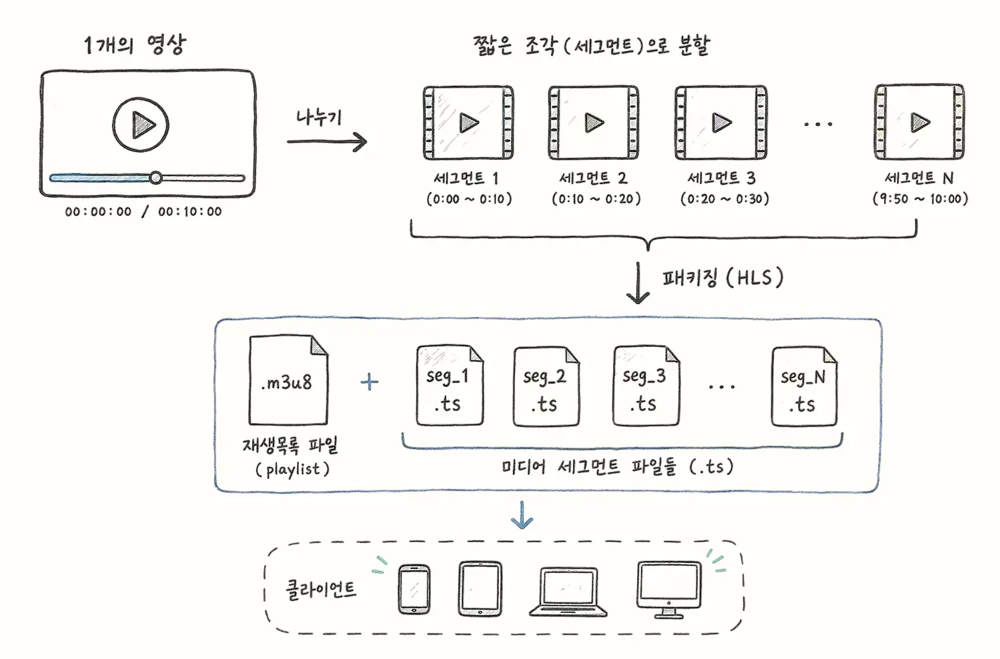
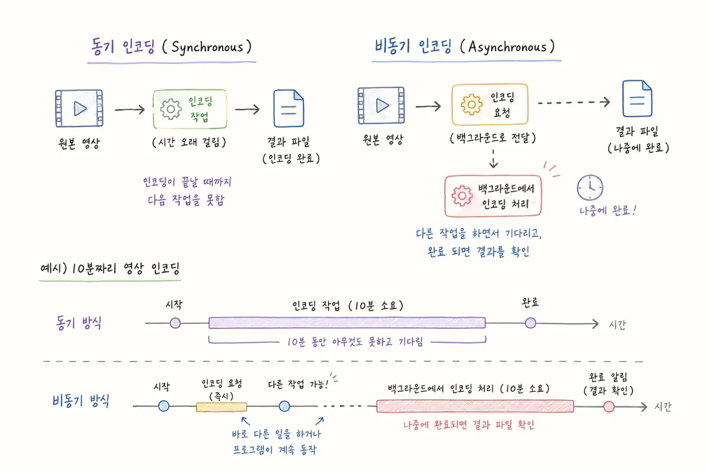
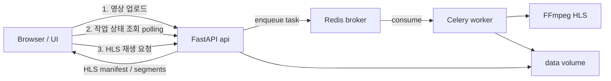

# FastAPI + Celery 영상 인코딩

PyCon 2026 핸즈온 튜토리얼

---

<header>프로젝트 목표</header>

- `FastAPI`와 `Celery`를 이용한 비동기 작업해보기
- 동영상 인코딩 작업에 대한 이해 
- 스트리밍 서비스 배포에 대한 흐름

---

<header>동영상 인코딩이란</header>

### HLS
동영상 로드를 빠르게 하기 위해 파일을 일정 크기로 나눠서 재생하는 HTTP 스트리밍 방식으로 <br/>
클라이언트는 HTTP로 서버로부터 세그먼트를 받아 이를 재생해서 빠른 재생이 가능

### 비동기 작업
오래 걸리는 작업을 사용자가 그대로 기다리지 않고 데이터만 추가한 뒤 <br/>
실제 작업은 서버에서 백그라운드로 처리하는 방식

---


<header>HLS</header>



---

<header>비동기 작업</header>



---

<header>구성할 시스템</header>

업로드는 API가 받고, 인코딩은 Celery worker가 Redis 큐를 통해 백그라운드에서 처리



- FastAPI: 업로드 수신, 작업 enqueue, 상태 API 제공, 정적 페이지와 HLS 서빙
- Redis: Celery broker(작업 큐)와 result backend(작업 상태)
- Celery worker: Redis에서 작업을 consume하고 FFmpeg로 인코딩 실행
- FFmpeg: 원본 영상을 HLS manifest와 segment로 변환
- data volume: 업로드 원본과 인코딩 결과를 API와 worker가 공유

---

<header>실습</header>

학습 편의를 위해 개발 환경은 세팅된 상태로 진행합니다.<br/>
막힐 경우 필요에 따라 체크포인트 브랜치로 이동해 이어서 실습합니다.

```cli
git fetch origin
git switch checkpoint/00-fastapi-setup
python scripts/dev.py docker
```

---

<header>FastAPI란</header>

Python으로 HTTP API를 빠르게 만들기 위한 웹 프레임워크

- 타입 힌트 기반으로 요청/응답을 검증
- `uvicorn`으로 실행하는 ASGI 앱
- `/docs`에서 Swagger UI를 자동 제공

```python
from fastapi import FastAPI

app = FastAPI()

@app.get("/health")
def health():
    return {"status": "ok"}
```

---

<header>FastAPI 구조</header>

이번 튜토리얼에서 쓰는 최소 구성

- `app = FastAPI(...)`: 앱 인스턴스
- `APIRouter`: 경로를 파일 단위로 분리
- `include_router(..., prefix="/api")`: `/api` 아래로 라우트 연결
- `StaticFiles`: 튜토리얼 HTML/CSS 제공

요청 처리 흐름: Client → uvicorn → FastAPI route → JSON 응답

---

<header>Checkpoint 00</header>

### FastAPI 초기 세팅

- Docker로 FastAPI 앱 기동
- `/api/health`와 `/docs` 확인

```cli
git switch checkpoint/00-fastapi-setup
```

성공 기준: `GET /api/health`가 `{"status":"ok"}`를 반환함

---

<header>Checkpoint 01</header>

### FastAPI 업로드

- 영상 업로드 API 구현
- `job_id` 디렉터리에 원본 저장

```cli
git switch checkpoint/01-fastapi-upload
```

성공 기준: `POST /api/videos` 응답에 `job_id`, `source_url`이 전달됨

---

<header>Checkpoint 02</header>

### Celery + Redis

- 업로드 직후 작업을 enqueue
- `GET /api/jobs/{job_id}`로 상태 조회

```cli
git switch checkpoint/02-celery-redis
```

성공 기준: API는 바로 `202`를 주고, worker 로그에 작업 수신이 보임

---

<header>Checkpoint 03</header>

### FFmpeg HLS

- worker에서만 FFmpeg 실행
- `playlist.m3u8`와 segment 생성

```cli
git switch checkpoint/03-ffmpeg-hls
```

성공 기준: `SUCCESS`일 때 `hls_url`이 내려옴

---

<header>Checkpoint 04</header>

### HLS Player

- 작업 상태 polling
- 원본과 HLS 결과 나란히 재생

```cli
git switch checkpoint/04-hls-player
```

성공 기준: `SUCCESS` / `FAILURE`에서 polling이 멈추고 영상이 재생됨

---

<header>운영</header>

---

# Q&A
