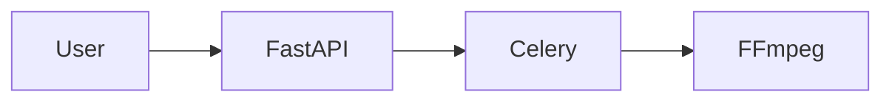

# FastAPI + Celery 영상 인코딩

PyCon 2026 핸즈온 튜토리얼

---

<header>프로젝트 목표</header>

- `FastAPI`와 `Celery`를 이용한 비동기 작업해보기
- 동영상 인코딩 작업에 대한 이해 
- 스트리밍 서비스 배포에 대한 흐름

---

<header>동영상 인코딩이란</header>

### HLS
동영상 로드를 빠르게 하기 위해 파일을 일정 크기로 나눠서 재생하는 HTTP 스트리밍 방식으로  
클라이언트는 HTTP로 서버로부터 세그먼트를 받아 이를 재생해서 빠른 재생이 가능

### 비동기 작업
오래 걸리는 작업을 사용자가 그대로 기다리지 않고 데이터만 추가한 뒤  
실제 작업은 서버에서 백그라운드로 처리하는 방식

---

<header>HLS</header>

---

<header>비동기 작업</header>

---

<header>구성할 시스템</header>

프로젝트 전체 구상도

---

<header>실습</header>

### 체크포인트

---

<header>사이드 프로젝트 경험담</header>

---

<header>Q&A</header>
