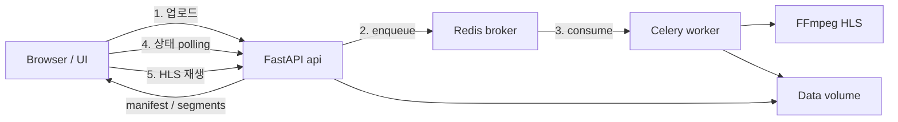

# FastAPI + Celery 영상 인코딩

PyCon 2026 핸즈온 튜토리얼

---

<header>프로젝트 목표</header>

- 오래 걸리는 작업을 HTTP 요청 밖으로 빼는 이유를 이해한다
- FastAPI로 업로드·상태 API를, Celery로 인코딩 작업을 나눈다
- HLS 결과물을 polling으로 받아 브라우저에서 재생한다
- 초급 실습 범위 밖의 운영 이슈를 개념으로만 짚어본다

---

<header>문제: 요청 안에서 인코딩하면?</header>

영상 인코딩은 수 초~수 분이 걸리는 CPU 집약 작업입니다.

요청 핸들러에서 FFmpeg를 그대로 실행하면:

- HTTP 응답이 끝날 때까지 클라이언트가 대기한다
- 타임아웃·연결 끊김이 나기 쉽다
- 웹 서버 워커가 인코딩에 묶여 다른 요청을 못 받는다

오늘 목표: **업로드는 바로 받고(`202` + `job_id`), 인코딩은 worker가 처리**

---

<header>HLS</header>

동영상 로드와 탐색을 빠르게 하기 위해 영상을 짧은 세그먼트로 나눠 HTTP로 보내는 스트리밍 방식입니다.

- 클라이언트는 manifest(`.m3u8`)를 읽고 필요한 segment만 순서대로 받아 재생합니다
- 처음부터 전체 파일을 받을 필요가 없어 재생 시작이 빨라집니다


---

<header>백그라운드 작업</header>

오래 걸리는 일을 사용자가 그대로 기다리지 않고, 작업만 큐에 넣은 뒤<br/>
서버(또는 worker)가 백그라운드에서 처리하는 방식입니다.


---

<header>FastAPI async ≠ Celery</header>

둘 다 비동기로 동작하지만 둘의 역할이 다릅니다.

| 구분 | FastAPI `async`/`await` | Celery 작업 큐 |
| --- | --- | --- |
| 목적 | 한 프로세스에서 많은 I/O 요청을 효율적으로 처리 | 오래 걸리는 일을 HTTP 밖으로 오프로딩 |
| 실행 위치 | 웹 서버(이벤트 루프) | 별도 worker 프로세스 |
| 적합한 일 | DB·HTTP·파일 I/O 대기 | FFmpeg 같은 CPU·장시간 작업 |
| 응답 | 요청 안에서 await하며 처리 | 즉시 `job_id` 반환 후 나중에 결과 조회 |

이번 튜토리얼의 핵심은 **Celery로 인코딩을 빼는 것**입니다.

---

<header>결과물 데이터 흐름</header>

업로드는 API가 받고, 인코딩은 Celery worker가 Redis 큐를 통해 백그라운드에서 처리합니다.



- FastAPI: 업로드 수신, 작업 적재, 상태 API, 정적 페이지·HLS 서빙
- Redis: Celery broker(작업 큐)와 result backend(작업 상태)
- Celery worker: 큐에서 작업을 가져와 FFmpeg 실행
- FFmpeg: 원본 → HLS(`playlist.m3u8` + segments)
- Data volume: FastAPI와 worker가 공유하는 원본·결과 스토리지

---

<header>FastAPI</header>

### 3가지 핵심
1. FastAPI는 Python으로 HTTP API를 빠르게 개발하는 ASGI 기반 웹 프레임워크
2. Python의 `async`/`await`와 이벤트 루프를 활용해 많은 동시 요청을 효율적으로 처리
3. 타입 힌트로 요청/응답 검증을 분석해 Swagger API 문서를 자동 생성

---

<header>FastAPI 문법</header>

이번 튜토리얼에서 사용하는 문법

- `app = FastAPI(...)`: 앱 인스턴스
- `APIRouter`: API 라우팅
- `include_router(..., prefix="/api")`: `/api` 아래에 라우터 등록
- `UploadFile` / `File(...)`: multipart 영상 업로드
- `StaticFiles`: HTML/CSS/JS·미디어 정적 서빙

---

<header>요청 처리 흐름</header>

브라우저의 HTTP 요청이 웹 서버를 거쳐 프레임워크 코드까지 내려간 뒤, 같은 경로로 응답이 돌아옵니다.


- Uvicorn: 소켓을 열고 HTTP를 받아 앱에 넘기는 ASGI 서버
- FastAPI: 라우팅, 검증, 응답 직렬화를 담당하는 프레임워크

---

<header>ASGI와 WSGI</header>

웹 서버와 Python 앱을 연결하는 인터페이스입니다. 동기/비동기를 어떻게 다루는지가 핵심입니다.

| 구분 | WSGI | ASGI |
| --- | --- | --- |
| 의미 | Web Server Gateway Interface | Asynchronous Server Gateway Interface |
| 요청 처리 | 동기 중심 | 동기와 비동기 모두 가능 |
| 대표 서버 | Gunicorn, uWSGI | Uvicorn, Hypercorn |
| 대표 프레임워크 | Django(전통적), Flask | FastAPI, Starlette, Django(ASGI 모드) |

- 전통적 Django는 WSGI + 워커 프로세스/스레드로 요청을 처리
- FastAPI는 ASGI 위에서 이벤트 루프로 I/O 대기를 다루고, 동기 엔드포인트는 ThreadPool에 맡김

---

<header>스레드와 이벤트 루프</header>

FastAPI는 이벤트 루프를 기본으로 쓰고, 동기 코드는 필요 시 스레드로 넘깁니다.

| 구분 | 스레드(Thread) | 이벤트 루프(Event Loop) |
| --- | --- | --- |
| 실행 단위 | 운영체제가 관리 | 애플리케이션이 관리 |
| 동시성 방식 | 여러 스레드를 병렬/동시 실행 | 하나의 스레드에서 작업을 번갈아 실행 |
| 장점 | CPU 작업에 상대적으로 적합 | I/O 대기에는 매우 효율적 |
| 단점 | 메모리·컨텍스트 스위칭 비용 | CPU 집약 작업에는 부적합 |
| FastAPI | 필요 시 ThreadPool 사용 | 기본 실행 방식 |

※ FFmpeg처럼 오래 걸리는 CPU 작업은 이벤트 루프에 두면 안 됩니다. → **별도 Celery worker**

---

<header>Celery</header>

Celery는 Redis나 RabbitMQ 같은 외부 큐를 이용해 작업을 워커에 분산시키는 비동기 작업 처리 시스템입니다.
즉 서비스에서 API는 작업을 적재만하며, 실제 작업을 Celery가 담당하죠.

- **Broker(작업 큐)**: 대기 중인 작업 메시지를 보관하는 곳으로 앱과 워커의 중간에서 작업을 중계
- **Worker**: broker에서 작업을 꺼내 FFmpeg 등 실행
- **Result backend(상태 큐)**: 작업의 `PENDING` / `STARTED` / `SUCCESS` / `FAILURE` 상태 보관
- **Task**: `@app.task`로 등록한 함수로 이 함수가 워커로 실행됨

※ API와 worker는 **같은 저장 공간**을 봐야 업로드 원본과 HLS 결과를 주고받을 수 있습니다.

---

<header>실습</header>

학습 편의를 위해 개발 환경은 세팅된 상태로 진행합니다.<br/>
막히면 해당 체크포인트 브랜치로 이동해 이어서 실습하면 됩니다.

```cli
git fetch origin
python scripts/dev.py docker
```

체크포인트는 `00` → `04` 순으로 전개됩니다.

---

<header>Checkpoint 00</header>

### FastAPI 초기 세팅

- Docker로 FastAPI 앱 기동
- `/api/health`와 `/docs` 확인

```cli
git switch checkpoint/00-fastapi-setup
```

성공 기준: `GET /api/health`가 `{"status":"ok"}`를 반환함

---

<header>Checkpoint 01</header>

### FastAPI 업로드

아직 인코딩은 없습니다. 업로드와 `job_id` 저장만 만듭니다.

- 영상 업로드 API 구현
- `job_id` 디렉터리에 원본 저장

```cli
git switch checkpoint/01-fastapi-upload
```

성공 기준: `POST /api/videos` 응답에 `job_id`, `source_url`이 전달됨

---

<header>Checkpoint 02</header>

### Celery + Redis

- 업로드 직후 작업을 enqueue
- `GET /api/jobs/{job_id}`로 상태 조회
- API는 인코딩이 끝나길 기다리지 않음

```cli
git switch checkpoint/02-celery-redis
```

성공 기준: API는 바로 `202`를 주고, worker 로그에 작업 수신이 보임

---

<header>Checkpoint 03</header>

### FFmpeg HLS

- **worker에서만** FFmpeg 실행
- `playlist.m3u8`와 segment 생성
- manifest가 있을 때만 `SUCCESS`

```cli
git switch checkpoint/03-ffmpeg-hls
```

성공 기준: `SUCCESS`일 때 `hls_url`이 내려옴

---

<header>Checkpoint 04</header>

### HLS Player

- 작업 상태 polling
- 원본과 HLS 결과 나란히 재생

```cli
git switch checkpoint/04-hls-player
```

성공 기준: `SUCCESS` / `FAILURE`에서 polling이 멈추고 영상이 재생됨

---

<header>운영에서 더 생각해볼 것</header>

초급 실습에서는 구현하지 않지만, 프로덕션에서는 이런 이슈가 이어집니다.

- 인코딩 타임아웃·작업 제한 시간
- Celery 재시도와 중복 실행(idempotency)
- worker concurrency / prefetch
- 업로드 크기 제한과 결과 파일 정리
- 작업 상태 영속화(DB), 외부 스토리지(S3 등)
- 로그·지표·알림

구조를 이해한 뒤 필요에 따라 확장하면 됩니다.

---

# Q&A
