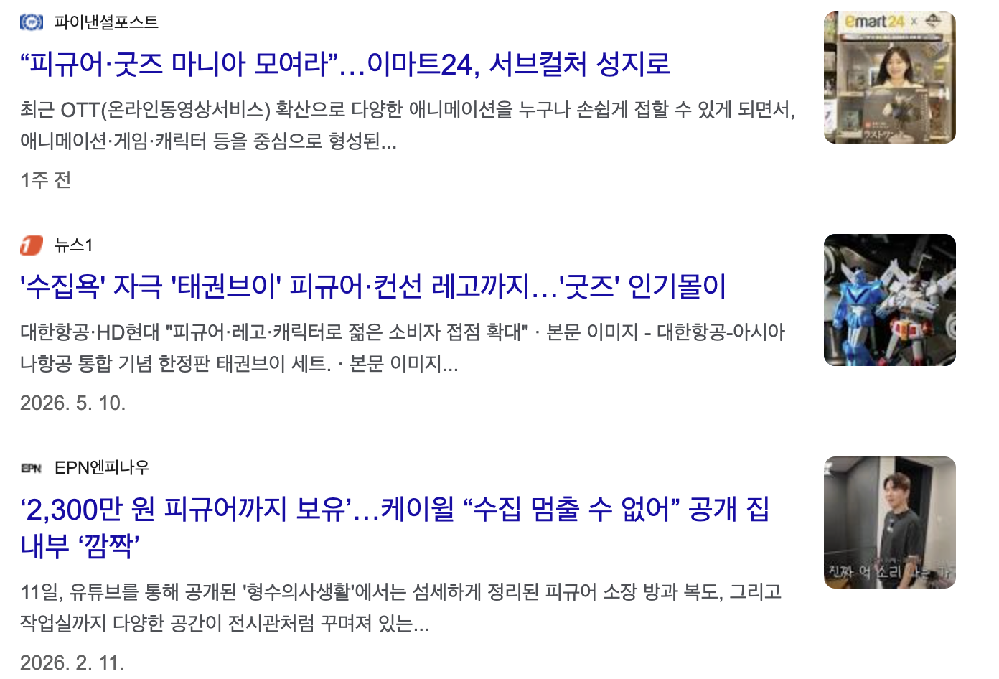
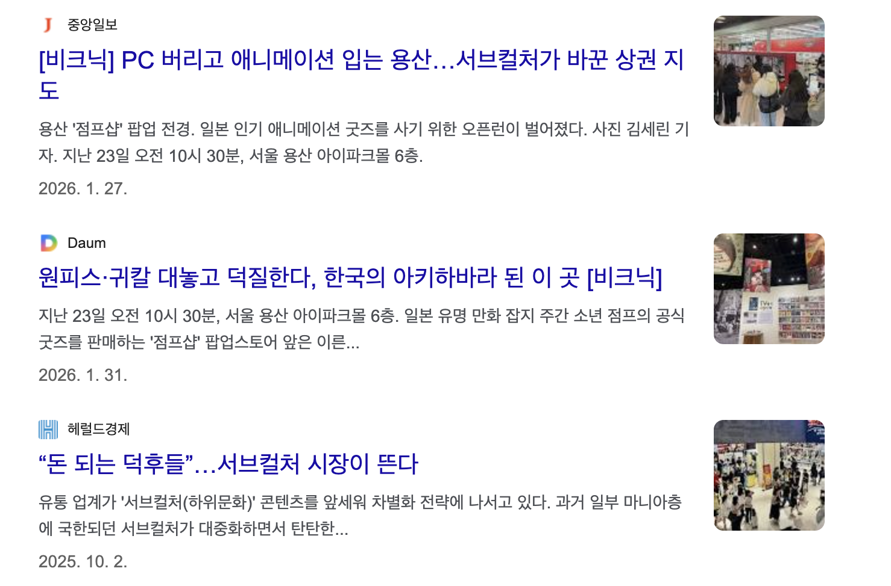
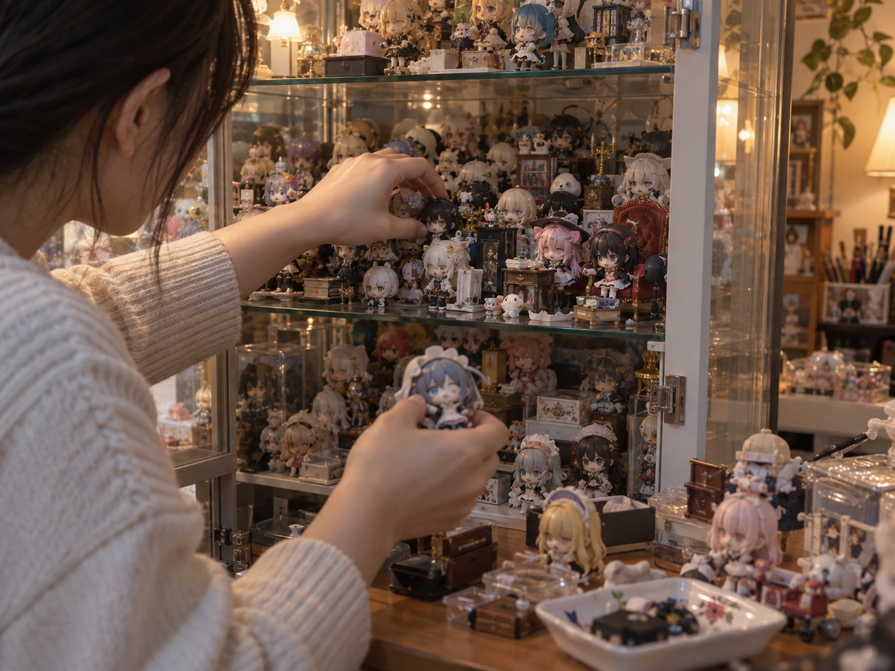
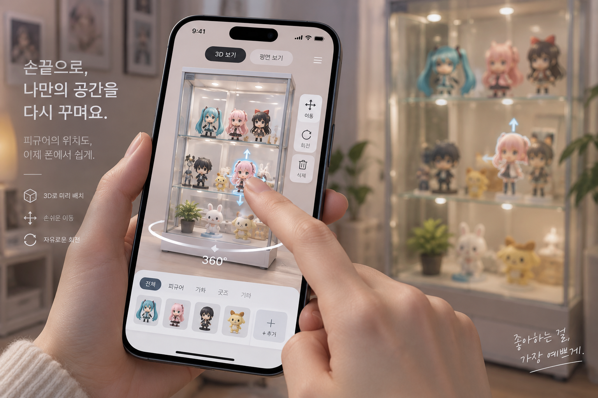

# FiguRoom   피규어 수집의 다음을 노린다.

실물 피규어와 장식장의 디지털 트윈

---

<header>서브컬쳐 수집</header>

현재 10~30대에서 가장 크게 성장하고 있는 분야 중 하나가  **서브컬처 수집** 입니다.  
피규어만이 아닙니다. 가챠, 뽑기, 캐릭터 굿즈까지 묶이는 큰 산업이죠.

---

<header>시장 규모</header>

이미 큰 시장이며, 지속적인 성장

- **신세계백화점 서브컬처 팝업** 2025년 매출 전년 대비 **+71%** ([관련 링크](https://www.todaykorea.co.kr/news/articleView.html?idxno=402208))
- **잠실 롯데월드몰 닌텐도 팝업** 2025년 방문객 **900만** ([관련 링크](https://www.todaykorea.co.kr/news/articleView.html?idxno=402208))
- **이마트24 가챠·뽑기** 2026 상반기 매출 전년 동기 대비 **+89.5%** ([관련 링크](https://news.bbsi.co.kr/news/articleView.html?idxno=4104982), [관련 링크](http://www.thefirstmedia.net/news/articleView.html?idxno=207857))
- **국내 서브컬처 게임 시장** 2022→2025년 **+41%** (CAGR 16.7% vs 전체 5.2%) ([관련 링크](https://www.newstomato.com/ReadNews.aspx?no=1288415))
- **글로벌 서브컬처 시장** 2021년 약 60조 → 2034년 약 **128조 원** 전망 ([관련 링크](https://v.daum.net/v/20260511070419927?f=p))
- **일본 애니메이션 굿즈 시장** 2024년 **7,488억 엔** 돌파 ([관련 링크](https://www.jk-daily.co.kr/news/articleView.html?idxno=37056))
- **캐릭터 13조 · K-팝 팬덤 8조** 취향 중고 거래 매년 두 자릿수 성장

---

<header>이 시장 속 사용자 니즈 </header>

1. 피규어 수집품의 구도를 바꾸고 싶지만 어떻게 바꿀지 모르겠다
2. 막상 바꾸고 마음에 안 들어서 원래대로 되돌린 적 있다
3. 내가 좋아하던 장면을 그대로 재현하고 싶다
4. 그냥 봐도 이쁘지만 더 이쁘게 보고 싶다
5. 사기 전에 집에 있는 컬렉션에 어떻게 넣을 지 미리보고 싶다

---

<header>사용자 니즈 충족</header>

위 니즈들을 한번에 충족하는 서비스입니다. 
**FiguRoom**은 장식장을 폰으로 옮겨, 실물을 꺼내기 전에 배치를 기획할 수 있습니다.

---

<header>서비스의 장점</header>

1. 컬랙션의 구도나 배치를 미리 기획할 수 있다.
2. 손가락 터치 만으로 어떤 위치가 더 좋은지 볼 수 있다.
3. 내가 좋아하던 장면과 비슷한 상품과 구도를 추천 받는 다.
4. 내가 좋아하는 피규어가 가장 이쁜 배치를 찾는 다.
5. 피규어를 구매하기전에 미리 가상으로 집 수납장에 배치해볼 수 있다.

---

<header>공간이 생긴다</header>

콜랙팅 문화에서 가장 큰 불편은 공간이 없다는 것입니다.

- 공간은 그대로인데 수집은 늘어납니다. 남는 건 선반 자리입니다
- 미리 기획하고 데이터들을 토대로 배치를 추천받으면 이 소중한 공간을 효율적으로 사용할 수 있습니다.
- 배치 앱을 넘어, 한정된 방에서 전시 공간을 만드는 **공간 메이커**가 됩니다.

---

<header>플랫폼 확장</header>

피규어라는 공통 소재로 사용자와 데이터를 쌓으면 이커머스로, 중고 거래 플랫폼으로의 다양한 확장이 가능합니다.

- 다른 사람들은 어떻게 꾸미는 지 확인하며 제품을 추천받을 수 있습니다.
- 애니메이션의 한 장면을 올리면, 그 구도를 재현할 상품을 추천합니다
- 기존 피규어와 잘 어울리는 다음 피규어를 찾습니다.
