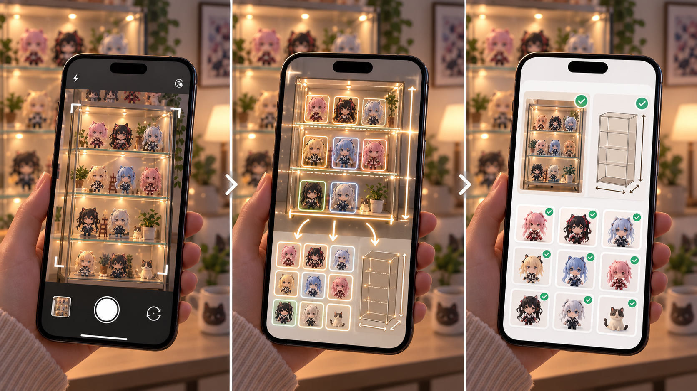
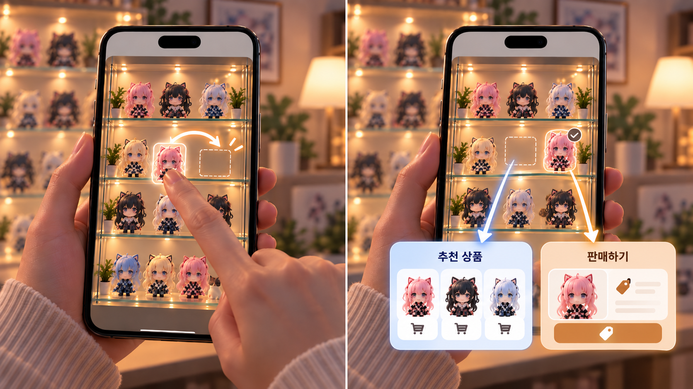
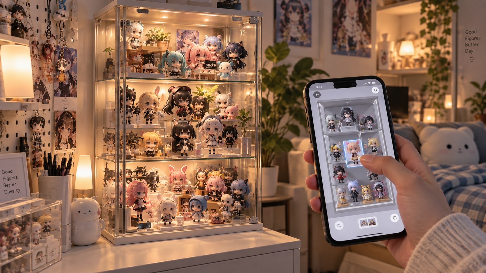
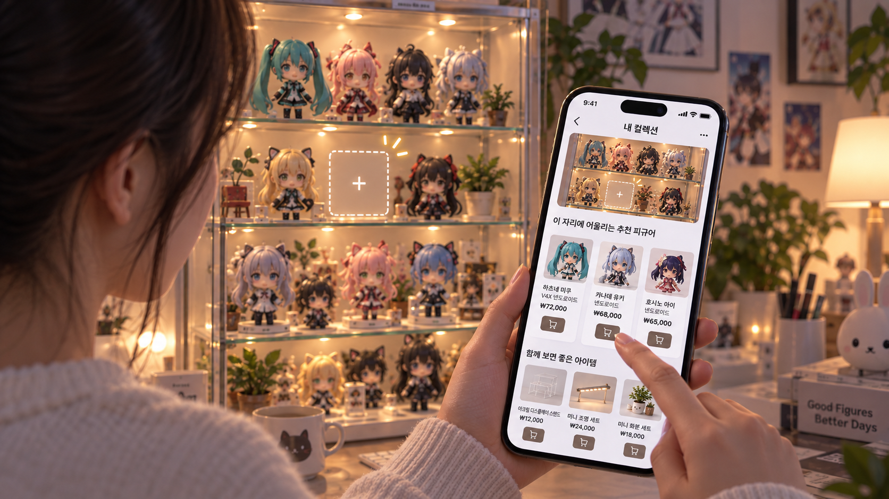

# FiguRoom   피규어 수집의 다음을 노린다.

실물 피규어와 장식장의 디지털 트윈

---

<header>서브컬처 수집</header>

현재 10~30대에서 가장 크게 성장하고 있는 분야 중 하나가 **서브컬처 수집**입니다.  
피규어만이 아닙니다. 가챠, 뽑기, 캐릭터 굿즈까지 묶이는 큰 산업이죠.

---

<header>시장 규모</header>

이미 큰 시장이며, 지속적인 성장 중입니다.

- **신세계백화점 서브컬처 팝업** 2025년 매출 전년 대비 **+71%** ([관련 링크](https://www.todaykorea.co.kr/news/articleView.html?idxno=402208))
- **잠실 롯데월드몰 닌텐도 팝업** 2025년 방문객 **900만** ([관련 링크](https://www.todaykorea.co.kr/news/articleView.html?idxno=402208))
- **이마트24 가챠·뽑기** 2026 상반기 매출 전년 동기 대비 **+89.5%** ([관련 링크](https://news.bbsi.co.kr/news/articleView.html?idxno=4104982), [관련 링크](http://www.thefirstmedia.net/news/articleView.html?idxno=207857))
- **국내 서브컬처 게임 시장** 2022→2025년 **+41%** (CAGR 16.7% vs 전체 5.2%) ([관련 링크](https://www.newstomato.com/ReadNews.aspx?no=1288415))
- **글로벌 서브컬처 시장** 2021년 약 60조 → 2034년 약 **128조 원** 전망 ([관련 링크](https://v.daum.net/v/20260511070419927?f=p))
- **일본 애니메이션 굿즈 시장** 2024년 **7,488억 엔** 돌파 ([관련 링크](https://www.jk-daily.co.kr/news/articleView.html?idxno=37056))
- **캐릭터 13조 · K-팝 팬덤 8조** 취향 중고 거래 매년 두 자릿수 성장

---

<header>이 시장 속 사용자 니즈</header>

1. 피규어 수집품의 구도를 바꾸고 싶지만 어떻게 바꿀지 모르겠다
2. 막상 바꾸고 마음에 안 들어서 원래대로 되돌린 적 있다
3. 내가 좋아하던 장면을 그대로 재현하고 싶다
4. 그냥 봐도 예쁘지만 더 예쁘게 보고 싶다
5. 사기 전에 집에 있는 컬렉션에 어떻게 넣을지 미리 보고 싶다

---

<header>사용자 니즈 충족</header>

이 니즈를 한 번에 충족하는 서비스입니다. 
**FiguRoom**은 장식장을 폰으로 옮겨 배치를 기획하고, 
현재 컬렉션에 어울리는 상품을 추천받으며, 일부를 중고로 거래할 수 있습니다.

---

<header>사용 시나리오 - 1</header>

1. 앱을 켜서 사진을 찍는다.
2. 사진에서 피규어 항목들이 선택되고 정보가 인식된다.
3. 나의 컬렉션으로 피규어 정보와 전시장 규격이 저장된다.

---

<header>사용 시나리오 - 2</header>

4. 내 컬렉션에서 배치를 바꿔볼 수 있다.
5. 상품을 추천받고, 안 쓰는 피규어는 중고로 거래한다.

---

<header>서비스의 장점</header>

1. 컬렉션의 구도나 배치를 미리 기획할 수 있다.
2. 손가락 터치만으로 어떤 위치가 더 좋은지 볼 수 있다.
3. 현재 배치와 조합에 맞는 상품을 추천받는다.
4. 피규어를 구매하기 전에 미리 가상으로 장식장에 배치해 볼 수 있다.
5. 컬렉션에서 안 쓰는 피규어를 중고로 거래할 수 있다.

---

<header>공간이 생긴다</header>

컬렉팅 문화에서 가장 큰 불편은 공간이 없다는 것입니다.

- 공간은 그대로인데 수집은 늘어납니다. 남는 건 선반 자리입니다.
- 미리 기획하고 데이터를 토대로 배치를 추천받으면 이 소중한 공간을 효율적으로 사용할 수 있습니다.
- 배치 앱을 넘어, 한정된 방에서 전시 공간을 만드는 **공간 메이커**가 됩니다.
- 어울리는 상품 추천과 중고 거래로, 남는 자리를 비우고 다시 채울 수 있습니다.

---

<header>이커머스 기능 확장</header>

출시 초기에는 사용자끼리 거래로 시작합니다.

나중에는 이커머스 기능과 피규어 제작까지 확장할 수 있습니다.
- 특정 장면을 그대로 모델링으로 바꾼 다음 직접 커스텀 피규어를 제작할 수 있습니다.
- 경매 기능을 추가해 희귀한 피규어의 가치를 보존합니다.

---

<header>끝</header>

FiguRoom을 더 자세히 보거나, 설문에 참여해 주세요.  
기획을 계속 고도화하므로 랜딩 페이지와 다를 수 있습니다.

- [랜딩 페이지: 이메일 접수](https://figuroom.devseung.com/)
- [피규어 수집·배치 경험 설문조사, 기프티콘 증정 (26.09.15 ~ 26.09.30)](https://forms.gle/z9e3J53oL5MZHGXb7)

